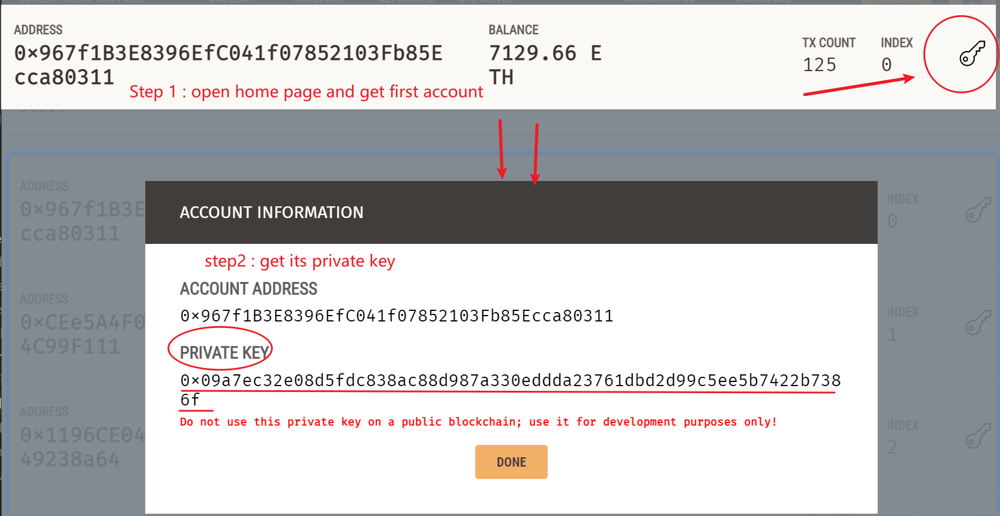

# 🚀 Web3智能合约平台

一个现代化的去中心化应用平台，集成了银行系统、DEX交易所、NFT市场、代币工厂和投票治理等功能。

> 📖 **语言版本**: [English](README.md) | [中文](README_CN.md)

## ✨ 主要功能

- 🏦 **银行系统** - 存款、贷款、质押功能
- 🔄 **DEX交易所** - 代币交换、流动性挖矿
- 🎨 **NFT市场** - 铸造、交易NFT
- 🏭 **代币工厂** - 创建自定义ERC20代币
- 🗳️ **投票治理** - 社区提案和投票

## 🚀 快速开始

### 1. 环境准备

**前置要求**
- Node.js 18+ (推荐使用 LTS 版本)
- Git
- 现代浏览器 (Chrome/Firefox/Edge)

```bash
# 克隆项目
git clone https://github.com/ZP151/web3_workspace.git
cd web3_workspace

# 安装所有依赖（包含所有必需的库）
npm install

# 如果安装失败，尝试清理缓存后重新安装
npm cache clean --force
npm install
```

> 💡 **注意**: 首次安装可能需要几分钟时间，包含了所有Web3开发必需的库

### 2. 安装MetaMask浏览器插件
1. **下载安装MetaMask**
   - Chrome: https://chrome.google.com/webstore/detail/metamask/nkbihfbeogaeaoehlefnkodbefgpgknn
   - Firefox: https://addons.mozilla.org/zh-CN/firefox/addon/ether-metamask/
   - Edge: https://microsoftedge.microsoft.com/addons/detail/metamask/ejbalbakoplchlghecdalmeeeajnimhm

2. **创建或导入钱包**（按MetaMask引导完成）

### 3. 启动本地区块链

**方式一：Anvil (Foundry) - 推荐**
```bash
# 启动Anvil并启用持久化（重启时保存状态）
node scripts/start-networks.js anvil --persistent

# 如果存在anvil-state.json文件，会自动重载数据
# 包括已部署的合约、账户余额和交易历史
```

**方式二：Ganache GUI应用**
1. 下载Ganache GUI: https://trufflesuite.com/ganache/
2. 安装并启动Ganache，推荐quick start，就不用下一步了
3. 创建新的工作区，设置：
   - **端口**: 8545
   - **网络ID**: 1337
   - **账户数量**: 10
   - **助记词**: 使用固定助记词以保持地址一致

**方式三：命令行启动**
```bash
# 如果没有Ganache GUI，可以用命令行
npx ganache --deterministic --accounts 10 --host 0.0.0.0 --port 8545 --networkId 1337 --chain.chainId 1337
```

### 4. 编译智能合约
```bash
# 编译所有智能合约
npm run compile
```

### 5. 一键部署所有合约和数据
```bash
# Anvil网络（推荐）
npx hardhat run scripts/deploy-master.js --network anvil

# Ganache网络
npx hardhat run scripts/deploy-master.js --network ganache

# Hardhat网络
npx hardhat run scripts/deploy-master.js --network hardhat
```

### 6. 启动前端应用
```bash
# 启动开发服务器
npm run dev
```

访问 `http://localhost:3000` 开始享用！

## 🔧 MetaMask详细配置

### 第一步：添加Ganache网络
1. 打开MetaMask插件
2. 点击左上角网络下拉菜单
3. 选择"add a custom network"
4. 填入以下信息：
   - **网络名称**: `Ganache Local`
   - **新的RPC URL**: `http://localhost:8545`
   - **链ID**: `1337`
   - **货币符号**: `ETH`
   - **区块浏览器URL**: 留空
5. 点击"保存"

### 第二步：导入测试账户
使用以下私钥导入Ganache测试账户（每个账户都有1000 ETH）：

**获取私钥方法：**
1. 打开Ganache GUI应用
2. 在主界面可以看到所有账户列表
3. 点击任意账户右侧的🔑图标查看私钥
4. 复制私钥用于MetaMask导入



### 导入步骤：
1. 打开MetaMask插件
2. 点击最顶上的账户下拉菜单
3. 点击最下方的Add account or hardware wallet
4. 点击Private Key
5. 粘贴私钥并点击"Import"
6. 重复以上步骤导入多个测试账户


## 📱 功能模块

### 🏦 银行系统 (`/banking`)
- 存款赚取利息 (5%年利率)
- 申请贷款 (8.5%年利率，150%抵押率)
- 质押挖矿 (12.5%年利率，7天锁定期)
- 实时查看收益和状态

### 🔄 DEX交易所 (`/dex`)
- 交换WETH/USDC/DAI代币
- 添加流动性赚取手续费
- 查看实时价格和滑点
- 流动性挖矿奖励

### 🎨 NFT市场 (`/nft`)
- 🤖 **AI图片生成** - 通过文字描述生成独特的NFT图片
- 🌐 **IPFS存储** - 支持上传到IPFS确保图片永久存储
- 🎨 **NFT铸造** - 铸造个人NFT (0.001 ETH)
- 🛒 **市场交易** - 购买和出售NFT
- 📊 **收藏管理** - 查看NFT收藏和统计数据

### 🏭 代币工厂 (`/tokens`)
- 创建自定义ERC20代币
- 设置代币名称、符号、供应量
- 查看已创建的代币
- 代币管理功能

### 🗳️ 投票治理 (`/voting`)
- 创建治理提案
- 参与社区投票
- 查看提案状态和结果
- 透明的治理流程

## 🛠️ 开发脚本

```bash
# 合约相关
npm run compile              # 编译智能合约
npm run test                # 运行合约测试

# 部署相关
npx hardhat run scripts/deploy-master.js --network anvil      # 部署到Anvil
npx hardhat run scripts/deploy-master.js --network ganache   # 部署到Ganache
npx hardhat run scripts/deploy-master.js --network hardhat   # 部署到Hardhat

# 网络检查
npx hardhat run scripts/test-network-stability.js --network ganache  # 检查网络状态

# NFT图片生成测试
node scripts/test-image-generation.js  # 测试图片生成API连接

# 前端相关
npm run dev                 # 启动开发服务器
npm run build              # 构建生产版本
npm run start              # 启动生产服务器
```

### 🔍 快速状态检查
运行以下命令检查环境是否正常：
```bash
# 1. 检查Node.js版本
node --version

# 2. 检查依赖安装
npm list --depth=0

# 3. 编译合约
npm run compile

# 4. 检查Ganache连接
npx hardhat run scripts/test-network-stability.js --network ganache
```

## 🔄 重置环境

当本地网络重置后，只需运行：
```bash
# Anvil网络（推荐）
npx hardhat run scripts/deploy-master.js --network anvil

# Ganache网络
npx hardhat run scripts/deploy-master.js --network ganache

# Hardhat网络  
npx hardhat run scripts/deploy-master.js --network hardhat
```

这会自动：
- 重新部署所有合约
- 创建测试代币 (USDC, DAI, WETH)
- 初始化DEX交易池
- 创建NFT测试数据
- 创建投票提案
- 更新配置文件

## 📊 测试数据

部署脚本会自动创建：
- **智能合约**: 7个核心合约
- **测试代币**: USDC, DAI, WETH
- **DEX交易池**: 3个交易对，已添加流动性
- **NFT数据**: 20个不同类型的NFT
- **投票提案**: 3个治理提案

## 🎯 项目结构

```
src/
├── app/                    # Next.js页面
│   ├── banking/           # 银行系统
│   ├── dex/              # DEX交易所
│   ├── nft/              # NFT市场
│   ├── tokens/           # 代币工厂
│   └── voting/           # 投票治理
├── components/            # React组件
├── lib/                  # 工具库
└── config/               # 配置文件

contracts/                 # 智能合约
├── EnhancedBank.sol      # 银行合约
├── DEXPlatform.sol       # DEX合约
├── NFTMarketplace.sol    # NFT市场
├── TokenFactory.sol      # 代币工厂
└── VotingCore.sol        # 投票合约

scripts/                  # 部署脚本
├── deploy-master.js           # 通用部署脚本（支持多网络）
└── deployment/               # 部署模块化脚本
```

## 🔒 安全特性

- OpenZeppelin安全库
- 重入攻击防护
- 访问控制机制
- 输入验证和边界检查
- 安全的数学运算

## 💡 使用技巧

- **网络切换**: 使用应用内的网络切换按钮
- **账户管理**: 在MetaMask中切换不同测试账户
- **交易确认**: 注意MetaMask弹窗进行交易确认
- **余额刷新**: 交易后页面会自动刷新余额
- **错误处理**: 查看浏览器控制台获取详细错误信息

## 📚 技术栈

- **前端**: React 18, Next.js 14, TypeScript, Tailwind CSS
- **Web3**: Wagmi, RainbowKit, Ethers.js v6
- **智能合约**: Solidity 0.8.x, Hardhat, OpenZeppelin
- **开发工具**: Ganache, MetaMask, Hardhat Network

## 🆘 常见问题与解决方案

### 安装相关问题

**Q: npm install 失败或缺少依赖？**
```bash
# 解决方案：清理缓存并重新安装
npm cache clean --force
rm -rf node_modules package-lock.json
npm install
```

**Q: Node.js版本不兼容？**
A: 确保使用Node.js 18+版本，推荐使用最新LTS版本

### Ganache相关问题

**Q: Ganache GUI下载地址？**
A: 官方下载: https://trufflesuite.com/ganache/

**Q: Ganache GUI推荐设置？**
A: 
1. 启动Ganache后选择"Quick Start"即可
2. 如需自定义，确保端口设置为8545，网络ID为1337
3. 账户数量建议设置为10个以上

**Q: 如何在Ganache GUI中查看私钥？**
A: 在账户列表中点击任意账户右侧的🔑(钥匙)图标

**Q: Ganache命令行启动失败？**
```bash
# 如果提示chainId参数错误，使用这个命令
npx ganache --deterministic --accounts 10 --host 0.0.0.0 --port 8545 --networkId 1337 --chain.chainId 1337
```

**Q: 端口8545被占用？**
```bash
# Windows查看端口占用
netstat -ano | findstr :8545
# 结束占用进程或更换端口
```

**Q: Ganache GUI无法启动？**
A: 
1. 确保已关闭其他占用8545端口的程序
2. 以管理员身份运行Ganache
3. 检查防火墙设置是否阻止了Ganache

### MetaMask相关问题

**Q: MetaMask无法连接到本地网络？**
A: 
1. 确保Ganache正在运行
2. 检查网络配置中的RPC URL是否正确
3. 尝试重置MetaMask连接

**Q: 交易失败或Gas费用错误？**
A: 
1. 检查账户ETH余额是否充足
2. 确保连接到正确的网络 (Chain ID: 1337)
3. 尝试重置账户交易历史

**Q: 账户导入后看不到余额？**
A: 
1. 确保MetaMask已切换到Ganache网络
2. 检查导入的私钥是否正确
3. 刷新页面或重启MetaMask
4. 确认Ganache正在运行且端口正确

**Q: 找不到"Add account or hardware wallet"选项？**
A: 
1. 确保点击的是顶部账户名称下拉菜单
2. 如果是旧版MetaMask，选项可能叫"Import Account"
3. 更新MetaMask到最新版本

**Q: 私钥导入失败？**
A: 
1. 确保私钥格式正确（以0x开头的64位十六进制字符）
2. 检查是否有多余的空格或换行符
3. 确保该私钥尚未被导入过

### 合约部署问题

**Q: 合约部署失败？**
```bash
# 解决方案：重新编译并部署
npm run compile
npx hardhat run scripts/deploy-master.js --network ganache
```

**Q: 找不到合约地址？**
A: 检查 `src/contracts/addresses.json` 文件是否存在且包含正确的地址

### 前端应用问题

**Q: 页面显示"合约未部署"？**
A: 
1. 确保已运行部署脚本
2. 检查MetaMask是否连接到正确网络
3. 刷新页面

**Q: 交易不触发MetaMask弹窗？**
A: 
1. 检查MetaMask是否已解锁
2. 确保网站已连接到MetaMask
3. 检查浏览器是否阻止了弹窗

**Q: NFT购买不成功？**
A: 
1. 确保使用正确的账户
2. 检查该NFT是否仍在销售中
3. 确保账户有足够的ETH余额

### 重置环境

**Q: 如何完全重置开发环境？**
```bash
# 1. 停止所有服务
# 2. 重启Ganache (或Anvil/Hardhat)
# 3. 重新部署 (根据使用的网络选择)
npx hardhat run scripts/deploy-master.js --network ganache  # Ganache
npx hardhat run scripts/deploy-master.js --network anvil    # Anvil
npx hardhat run scripts/deploy-master.js --network hardhat  # Hardhat
# 4. 在MetaMask中重置账户交易历史
# 5. 刷新前端页面
```

## 📄 详细文档

查看 [`docs/QUICK_SETUP_GUIDE.md`](docs/QUICK_SETUP_GUIDE.md) 获取更详细的设置说明。

---

**开始您的Web3开发之旅！** 🚀